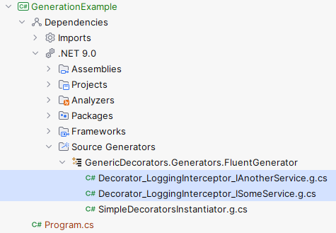

Introduction to Generic Decorators
==================================

Writing your first Interceptor
------------------------------

**Generic Decorators** library allows you to generate decorators during compile time using `Roslyn's Source Generators <https://devblogs.microsoft.com/dotnet/introducing-c-source-generators/>`_, based on an interceptor
and an interface.

When we are talking about *decorating* some method of a type (in our case of an *interface*, because **Generic Decorators** can **only be used to produce decorators for interfaces**, not abstract classes), we are talking
about performing some actions before and/or after the execution of the given method, also possibly interacting with the result of the execution in some way. In any case, such logic can be encapsulated into a component known
as *an interceptor*. It is an interceptor, in the sense that if the decorated version of the method is invoked, the execution flow is intercepted and controlled by that component.

The Generic Decorators library tries to provide means for writing all kinds of decorators and achieves it through providing several kinds of interceptors which are shipped with the nuget package. The interceptors are grouped
into categories, based on whether or not they give you the access to the arguments of the method that they are decorating. There are following categories of interceptors defined by Generic Decorators library

#. Simple Interceptors -- they are simple in the sense that they don't provide any access to the parameters of the underlying methods that they are decorating.
#. TBA.

In this section we will use simple interceptors as an example for a gentle introduction. The `cookbook <TBA>`_ will provide more examples of how to use different kinds of interceptors to achieve different kinds of access
to the arguments passed to the underlying methods.

In order to implement a simple interceptor that the Generic Decorators library would be able to use for decorating arbitrary interfaces with it, you need to inherit from an abstract class `SimpleInterceptor`, which is defined and
shipped with `GenericDecorators.Extensions.Core <TBA>`_ nuget package. In the following example we will define an interceptor that simply meters the execution time of any method that returns ``void``:

.. _BasicSimpleInterceptorUsage:
.. sourcecode:: csharp
    :linenos:
    
    using GenericDecorators.Extensions.Core.BaseInterceptors;
    using System.Diagnostics;

    public class MeteringInterceptor : SimpleInterceptor
    {
        public override void Process<TMethodContext>(
            in TMethodContext methodContext,
            Action<TMethodContext> internalImplementation)
        {
            var sw = new Stopwatch();
            sw.Start();

            internalImplementation(methodContext);

            sw.Stop();
            Console.WriteLine($"Elapsed time: {sw.ElapsedMilliseconds} ms");
        }
    }

Before we apply it to any interface to get a decorated version of that interface, let's take a closer look at what's happening in the code snippet above.

We are overriding some predefined ``Process`` method. This method is defined in the ``SimpleInterceptor`` and provides you with the ability to define what is going to happen during decoration, as well as how your decorating
logic should interact with the underlying, "real" implementation of the method that it's being used to decorate.

As you can see, the interceptor creates an instance of ``Stopwatch``, then calls the underlying implementation of the method that it's decorating, which is represented by an action ``internalImplementation``.
The action receives an instance of some generic type ``TMethodContext``, which, together with the ``internalImplementation`` action itself, is passed to the ``Process`` as a parameter.

During the invocation, the ``methodContext`` will contain everything that is required
for the internal implementation to run correctly - it will be instantiated by the decorator generated by the library and will contain the reference to the underlying implementation and the arguments that need to be handed
over to the underlying implementation. Wrapping all of this into an ``Action`` and passing it to the ``Process`` gives control over when and how the internal implementation is invoked to you, the user of the library.
The definition of the actual ``TMethodContext`` will also be generated by the library and will vary from method to method. If you are interested, it is possible to inspect the type definitions for those contexts,
they are generated as nested types within the decorator type.

Let's take a closer look at the ``SimpleInterceptor`` type and the members it defines.

Classifying the methods
-----------------------

.. note::

   This section only discusses members of ``SimpleInterceptor``. While other Interceptors are somewhat different, we will be focusing on the fundamental aspects shared by all of them.

In the motivation to the project, we mentioned that in principle, it is easily conceivable to have a single piece of decorating logic that can be "applied" to any method of an underlying implementation. We saw examples,
where in the decorating code, we simply invoke the method of the internal implementation (represented by an ``Action``).

In fact, a simple ``Action`` can in fact encapsulate a wide variety of methods, even ones that accept parameters and return values (despite the fact that ``Action`` itself doesn't):

.. sourcecode:: csharp
    :linenos:

    var calculator = new Calculator();

    // the arguments are captured, the returned value - discarded
    var action = () => calculator.Add(2, 2);

    // action can be invoked directly or passed to some method for later invocation
    action();

    public class Calculator
    {
        public int Add(int a, int b)
        {
            return a + b;
        }
    }

However, when defining interceptors, we might want to interact with the result of the execution of the underlying implementation. For example, if the return type is ``int``, we might want to print it from an interceptor
and if it's ``Task<int>``, we might want to ``await`` for it first. We would also likely want to return the value from our decorator -- after all, most of the time, a decorator is a layer between the caller
of the method and the "real" implementation.

Because of that, Generic Decorators library distinguishes between several kinds of methods that it allows to decorate. Base interceptors from the Generic Decorators library (like ``SimpleInterceptor``)
provie virtual methods, correponding to those defined kinds. For example, an example from the :ref:`previous section <BasicSimpleInterceptorUsage>` overrides ``SimpleInterceptor``'s ``Process`` virtual method to define
decorating logic for all methods that return ``void``. The internal implementation is represented by an ``Action`` that takes some compile-time-generated structure that encapsulates the reference to the internal implementation
and all parameters of the method in question.

#. ``Process`` -- methods that return ``void``:

   .. sourcecode:: csharp

      void Process<TMethodContext>(
          in TMethodContext methodContext,
          Action<TMethodContext> internalImplementation)

#. ``ProcessWithReturnType`` -- methods that can return any non-awaitable type, represented by the generic type parameter ``TOutput``:

   .. sourcecode:: csharp

      TOutput ProcessWithReturnType<TMethodContext, TOutput>(
          in TMethodContext methodContext,
          Func<TMethodContext, TOutput> internalImplementation)

#. ``ProcessAsync`` -- methods that return a ``Task`` (non-generic):

   .. sourcecode:: csharp

      Task ProcessAsync<TMethodContext>(
          TMethodContext methodContext,
          Func<TMethodContext, Task> internalImplementation)

#. ``ProcessWithReturnTypeAsync`` -- methods that return a ``Task<TOutput>``:

   .. sourcecode:: csharp

      Task<TOutput> ProcessWithReturnTypeAsync<TMethodContext, TOutput>(
          TMethodContext methodContext,
          Func<TMethodContext, Task<TOutput>> internalImplementation)

#. ``ProcessValueTaskAsync`` -- methods that return a ``ValueTask`` (non-generic):

   .. sourcecode:: csharp

      Task ProcessValueTaskAsync<TMethodContext>(
          TMethodContext methodContext,
          Func<TMethodContext, ValueTask> internalImplementation)

#. ``ProcessWithReturnTypeValueTaskAsync`` -- methods that return a ``ValueTask<TOutput>``:

   .. sourcecode:: csharp

      Task<TOutput> ProcessWithReturnTypeValueTaskAsync<TMethodContext, TOutput>(
          TMethodContext methodContext,
          Func<TMethodContext, ValueTask<TOutput>> internalImplementation)

When writing an interceptor, if you want to intercept a certain kind of method (as classified above), you need to implement a correponding virtual method. This approach has a side effect of redundancy. For example, if we want
to define an interceptor that can be used to decorate all ``void`` and non-awaitable methods with return types with the logging logic, it might look something like this:

.. sourcecode:: csharp
    :linenos:

    using GenericDecorators.Extensions.Core.BaseInterceptors;
    using System;

    public class LoggingInterceptor : SimpleInterceptor
    {
        public override void Process<TMethodContext>(
            in TMethodContext methodContext,
            Action<TMethodContext> internalImplementation)
        {
            Console.WriteLine("Before method execution");
            
            internalImplementation(methodContext);
            
            Console.WriteLine("After method execution");
        }

        public override TOutput ProcessWithReturnType<TMethodContext, TOutput>(
            in TMethodContext methodContext,
            Func<TMethodContext, TOutput> internalImplementation)
        {
            Console.WriteLine("Before method execution");
            
            var result = internalImplementation(methodContext);
            
            Console.WriteLine("After method execution");
            
            return result;
        }
    }

In this example, the code on lines 10 and 14 is repeated on lines 21 and 25. However, we can also see the rationale for the distinction we just introduced -- line 27 only makes sense for non-void methods.

In principle, one could argue that having six distinct categories of methods is excessive and that fewer might suffice. However, the authors believe that the current setup strikes a good balance -- what is
lost in conciseness is gained in flexibility.

.. _triggering-generation:

Triggering the generation
-------------------------

.. note::

    This section emphasizes triggering generation via ``Decorator.For<TInterface, TInterceptor>`` -- a nice approach for a C# project that uses Factory/Builder patterns for instantiating types. This approach is used
    for demonstrating an idea, other *triggers* are used for ASP.NET projects where static factories wouldn't be idiomatic.

When working with Roslyn Source Generators, it's important to understand how they are triggered to perform their task. In contrast to "normal" code, which is executed via explicit invocation at **runtime**,
Source Generators are activated at **compile-time**. During compilation, the Roslyn platform allows them to inspect the entire source code and generate new code based on that inspection. In other words, they
make decisions based on the code's **syntax**, not its **semantics**.

Earlier, we stated that the Generic Decorators library allows to generate decorators during compile time, based on a pair of types -- an interceptor and an interface. We looked into what goes in defining
an intrceptor, now we need to see how to communicate to the Generic Decorators library (in the sense defined in previous paragraph) to generate a concrete decorator.

Let's look at the example usage of Factory pattern, supported by the Generic Decorators library:

.. sourcecode:: csharp

    var decoratorBuilder = Decorator.For<ISomeService, LoggingInterceptor>();

Here, ``Decorator.For<TInterface, TInterceptor>`` is a static method within a static type, shipped with the Generic Decorators library. It has multiple purposes, but for now let's focus on the following:
it serves as a **trigger** for the library's source generator, that kicks in during compilation and generates a concrete decorator.

In the example above, ``ISomeService`` can be *any* interface and a ``LoggingInterceptor`` inherits from a ``SimpleInterceptor``. During compilation, the Generic Decorators source generator sees this **syntax**,
ensures that some constraints are met (for example, a ``For`` method is really the ``For`` that is shipped with the library and not some other method with a similar signature and that ``ISomeService`` is
indeed a concrete interface and not a type parameter) and generates a concrete decorator.

Let's consider a following example:

.. sourcecode:: csharp
    :linenos:

    using GenericDecorators.Extensions.Core.BaseInterceptors;
    using GenericDecorators.Extensions.Fluent;

    Decorator.For<ISomeService, LoggingInterceptor>();
    Decorator.For<IAnotherService, LoggingInterceptor>();

    public interface ISomeService
    {
        void Execute(string parameter);
    }

    public interface IAnotherService
    {
        void PerformAction(int value);
    }

    public class LoggingInterceptor : SimpleInterceptor
    {
        public override void Process<TMethodContext>(
            in TMethodContext methodContext,
            Action<TMethodContext> internalImplementation)
        {
            Console.WriteLine("Entering method");
            
            internalImplementation(methodContext);
            
            Console.WriteLine("Exiting method");
        }
    }

Simply because of the usages of ``For`` in our syntax on lines 4 and 5, the Generic Decorators library knows to generate concrete decorator implementations for the found combinations of intefaces and interceptors:

In the output directory for types generated by our Source Generators, you will find three generated files. Two of these files are clearly named to reflect the combinations of interfaces and interceptors recognized
by the Generic Decorators library:

#. Decorator_LoggingInterceptor_IAnotherService.g.cs
#. Decorator_LoggingInterceptor_ISomeService.g.cs

These types in those files (as well as the files themseleves) follow a consistent naming convention ``Decorator_{interceptor}_{interface}``.

This naming pattern is useful for inspecting the generated output. However, it’s important to note that consumers of the library are not expected to interact with these generated types directly. All interaction --
such as instantiation -- is handled through a separate set of types, some of which are included with the library, while others are generated automatically.

In addition to the decorator types, you will also see a third type -- ``SimpleDecoratorsInstantiator``. This class serves as a factory for creating instances of the generated decorators. Its usage and role in the
instantiation process will be covered in a later section.

Inspecting generated decorators
-------------------------------

.. note::

    You do not need to understand the generated types in order to use the Generic Decorators library effectively. It is still recommended to get somewhat familiar with the ideas that go into building decorators.

Let's take a look at the contents of *Decorator_LoggingInterceptor_ISomeService.g.cs* from the example above (slightly formatted for better readibility):

.. sourcecode:: csharp
    :linenos:

    namespace Decorators.LoggingInterceptor.ISomeService
    {
        public class Decorator : global::ISomeService
        {
            private readonly global::ISomeService _underlyingImplementation;
            private readonly global::System.Collections.Generic.HashSet<global::System.String> _applicableMembers;
            private readonly global::LoggingInterceptor _interceptor;

            public Decorator(
                global::ISomeService underlyingImplementation,
                global::System.Collections.Generic.HashSet<global::System.String> applicableMembers,
                global::LoggingInterceptor interceptor)
            {
                this._underlyingImplementation = underlyingImplementation;
                this._applicableMembers = applicableMembers;
                this._interceptor = interceptor;
            }

            private struct ExecuteMethodContext_0
            {
                public global::ISomeService underlyingImplementation;
                public global::System.String parameter;
            }

            void global::ISomeService.Execute(global::System.String parameter)
            {
                if (_applicableMembers != null && !_applicableMembers.Contains(nameof(global::ISomeService.Execute)))
                {
                    _underlyingImplementation.Execute(parameter);
                }

                var methodContext = new ExecuteMethodContext_0
                {
                    underlyingImplementation = _underlyingImplementation,
                    parameter = parameter
                };

                _interceptor.Process(in methodContext, static (methodContext) =>
                {
                    methodContext.underlyingImplementation.Execute(methodContext.parameter);
                });
            }
        }
    }

We can see that it is a single type called ``Decorator`` in a dedicated namespace (that also mimicks previously described convention) that indeed implements ``ISomeService``, receives an internal implementation of the same type,
an interceptor ``LoggingInterceptor`` and a ``HashSet<string>`` for filtering applicable members.

Let's take a closer look at the implementation of ``ISomeService.Execute`` (line 25).

First, on lines 27-30, there is a check that allows to short-circuit the execution and default to the internal implementation, based on the values in ``_applicableMembers``. The value for this set has been passed thorugh constructor, but we haven't
discussed instantiation yet, so let's ignore that par for now.

After that, on lines 32-36, we instantiate a certain structure ``ExecuteMethodContext_0``, that has been defined as a nested type on lines 19-23. This structure is generated per-method and contains everything that the interceptor will
eventually need in order to trigger the internal implementation -- a reference to the internal implementation and a value passed to the method during invocation.

This structure is then passed to the ``LoggingInteceptor``'s ``Process`` on line 38. That method, as we saw, is a virtual method define by the ``SimpleInterceptor``. Let's recall its definition in the context of its invocation to see how the pieces fit
(slightly modified for clarity):

.. sourcecode:: csharp

    public override void Process<TMethodContext>(
        in TMethodContext methodContext,
        Action<TMethodContext> internalImplementation)
    {
        ...
    }

.. sourcecode:: csharp

    _interceptor.Process<ExecuteMethodContext_0>(
        methodContext: in methodContext,
        internalImplementation: static (ExecuteMethodContext_0 methodContext) =>
        {
            methodContext.underlyingImplementation.Execute(methodContext.parameter);
        }
    );

What interceptor perceives as an ``Action<TMethodContext>`` (that allows authors of the interceptor to invoke a method on an internal implementation), in the case of the decorator for ``ISomeService.Execute`` is a  ``static`` lambda that needs a
``ExecuteMethodContext_0``, expects it to contain a reference to the internal impelmentation, a parameter passed during the invocation and knows to invoke the ``Execute`` on that internal impelmentation in with that parameter.

Because the method "context" (e.g. ``ExecuteMethodContext_0``) definitions are generated per-method, they are tailored to contain all the fields for holding the internal implementation and all the parameters that are required to invoke that method.
Because they are instantiated per method invocation, they contain the actual values passed to the method. Meanwhile, interceptor's ``Process`` does not need to know any of the details to actually use them, it's all tucked away behind
an ``Action<TMethodContext>`` -- that's why the interceptor can be reused accross all ``void`` methods in the given interface, and ineed, in other interfaces just as well.

Instantiating the decorators
----------------------------

Now that we've seen how to define interceptors and generate decoroator definitions based on them, let's see how to instantiate the generated decorators.

.. note::

    Much like the :ref:`section on generating decorators <triggering-generation>`, this section focuses on decorators that are generated using the static method ``Decorator.For<TInterface, TInterceptor>``.
    Instantiating decorators for use with ASP.NET's dependency injection (DI) is a separate topic and is not covered here. The goal of this section is to introduce core concepts that apply universally to all generated decorators.